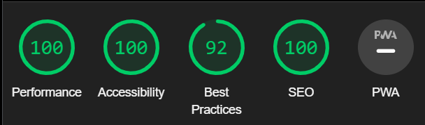

# Germany Quiz

Welcome to the Germany Quiz! This quiz is designed to test your knowledge about Germany in a fun and interactive way. Answer a series of true or false questions and see how well you know this fascinating country.

## Features

- 10 true or false questions about Germany.
- User-friendly interface with minimalist design.
- Germany's flag colors used in the styling.
- Score tracking system to keep track of your progress.
- Colorful images to support the correct/incorrect answers.
- User can create a username for a personalized experience.
- Immediate feedback on each question.
- Ability to restart the quiz and play again.

## Technologies Used

- HTML
- CSS
- JavaScript

## How to Play

1. Open the Germany Quiz in your web browser.
2. Enter a username to personalize your quiz experience.
3. Click the "Start" button to begin the quiz.
4. Read each question carefully and choose either "True" or "False" as your answer.
5. Receive immediate feedback on whether your answer is correct or incorrect.
6. Enjoy the colorful images that accompany the questions.
7. Track your score as you progress through the quiz.
8. Finish the quiz after answering all 10 questions.
9. View your final score and a fun completion message.
10. If you want to play again, simply click the "Restart" button.

## First View of the site

- First thing the user will see is two options to choose. They can choose if they want to start off reading the instructions or start right away with the game. 

- This image and all around it was decided to be like that in order to catch users' eye and produce an impact on them with all the colors from the image and a welcoming text. 

 ## Color Scheme
 - The color scheme has been chosen and applied through the whole website on purpose. The user will see the Germany's flag colors throughout the whole website. 
 

 ##  Validator Testing
- HTML:
No errors were returned when passing through the official W3C validator

- CSS :
No errors were found when passing through the official (Jigsaw) validator

- Js hint:

- Lighthouse:
I ran a test on Lighthouse to check the accesibility and performance  of the website

- I also checked that all the links work throughout the 4 pages (Home, Food, Culture, City and Newsletter) as well in the main page (Home) where user can find clickeable links to the different pages of the website. 

##  Frameworks, Libraries and Programs Used
- Google Fonts - for the font families: PlayFair Display and Lato.  San-serif was used as a default font.
- GitPod - to creat my html files and styling sheet before pushing the project to Github.
- GitHub - to store my repository for submission.
- Am I Responsive? - to ensure the project looked good across all devices.
- 
##  Deployment
- The site was deployed to GitHub pages. The steps to deploy are as follows:
1. In the GitHub repository, navigate to the Settings tabgit
From the source section drop-down menu, select the Master Branch
2. Once the master branch has been selected, the page will be automatically refreshed with a detailed ribbon display to indicate the successful deployment.

The live link can be found here : https://ekrasutzky.github.io/Germany-Quiz/

##  Credits
- As my knowledge is a bit  limited in this stage of learning, the initial set up & style was inspired by the 'Love Running' project, like  the design of the navigation bar, along with the display of the social links in the footer element.
