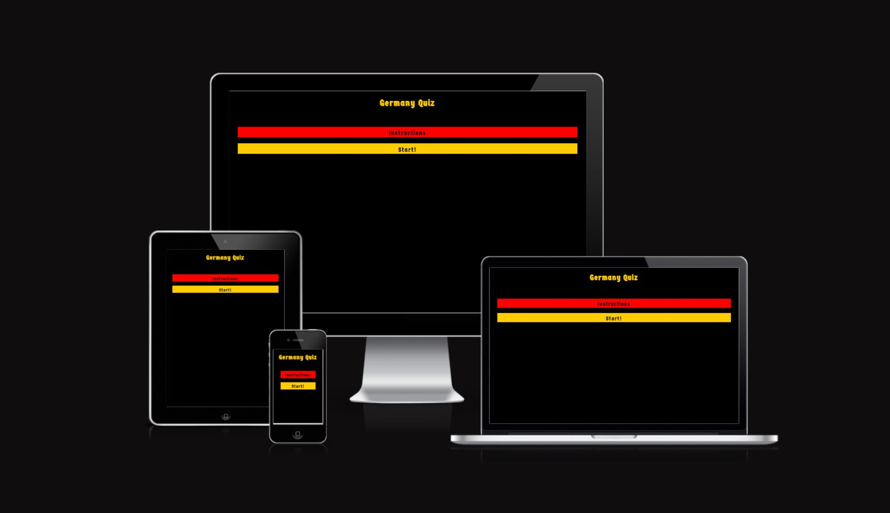

# Germany Quiz

Welcome to the Germany Quiz! This quiz is designed to test your knowledge about Germany in a fun and interactive way. Answer a series of true or false questions and see how well you know this fascinating country.

## Features

- 10 true or false questions about Germany.
- User-friendly interface with minimalist design.
- Germany's flag colors used in the styling.
- Score tracking system to keep track of your progress.

- User can create a username for a personalized experience.

- Immediate feedback on each question.
- Ability to restart the quizd play again and feedback on the results

## Technologies Used

- HTML
- CSS
- JavaScript

##  Frameworks, Libraries and Programs Used
- Google Fonts - for the font families: 'Germania One'.  Cursive was used as a default font.
- GitPod - to creat my html files and styling sheet before pushing the project to Github.
- GitHub - to store my repository for submission.
- Am I Responsive? - to ensure the project looked good across all devices.

## How to Play

1. Open the Germany Quiz in your web browser.
2. Enter a username to personalize your quiz experience.
3. Click the "Start" button to begin the quiz.
4. Read each question carefully and choose either "True" or "False" as your answer.
5. Receive immediate feedback on whether your answer is correct or incorrect.
6. Enjoy the colorful images that accompany the questions.
7. Track your score as you progress through the quiz.
8. Finish the quiz after answering all 10 questions.
9. View your final score and a fun completion message.
10. If you want to play again, simply click the "Restart" button.

## First View of the site

- First thing the user will see is two options to choose. They can choose if they want to start off reading the instructions or start right away with the game. 

- This image and all around it was decided to be like that in order to catch users' eye and produce an impact on them with all the colors from the image and a welcoming text. 

 ## Color Scheme
 - The color scheme has been chosen and applied through the whole website on purpose. The user will see the Germany's flag colors throughout the whole website. 
 

 ##  Validator Testing
- HTML:
No errors were returned when passing through the official W3C validator

- CSS :
No errors were found when passing through the official (Jigsaw) validator

- Js hint:
No errors were found while runing test on JH hint. 

- Lighthouse:
I ran a test on Lighthouse to check the accesibility and performance  of the website

- I also checked that all the links work throughout the 3 pages (Index, Instructions and the the game itself) as well in the main page (Index) where user can find clickeable link by clicking on the "Germany Quiz" title to the different pages of the website. 

## User Stories 
- As a visiting user, i would like:
-- To play a quiz regarding Germany
-- To be able to choose a name to play the game and have feedback about my right or wrong answers
-- To have a score counter 
-- To have the possibility to restart the game

## Test Cases
 - As going through Index.html, the user can find the title of the game and two options to click on: "Instructions" and "Start!"
 - If the user chooses to click on the "Instructions" button, the user will see a welcoming title, followed by ten steps to follow about how to play the game. At the end of those instructions, there will be the "Start" button to play the game right away. 
 - When the user clicks the "Start" button, either in the Index.html or at the end of the instructions.html, the user will be linked to the start.html page. Meaning that once there, the user will see the title of the game, a bar to log a name, a "start" button and a score counter. Once the name has been chosen, user should press "start" (that's the only way to start the game, otherwise, the button will not activate the game). Once the user logs the name and hit start, the user will be tested with 10 questions about Germany while having the score number and an inmediate feedback about their answers whether if it's correct or incorrect. After answering the 10 questions, the user will find a final feedback, the number of right questions answered and if they passed or not the test along with a "restart" button to play again. 

##  Deployment
- The site was deployed to GitHub pages. The steps to deploy are as follows:
1. In the GitHub repository, navigate to the Settings tabgit
From the source section drop-down menu, select the Master Branch
2. Once the master branch has been selected, the page will be automatically refreshed with a detailed ribbon display to indicate the successful deployment.

The live link can be found here : https://ekrasutzky.github.io/Germany-Quiz/

 
